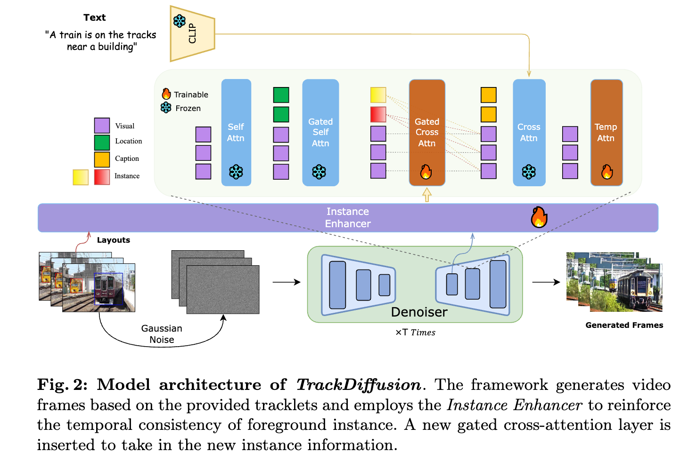

## TrackDiffusion: Tracklet-Conditioned Video Generation via Diffusion Models

Pytorch implementation of [TrackDiffusion: Tracklet-Conditioned Video Generation via Diffusion Models](https://arxiv.org/abs/2312.00651)

## Abstract 

Despite remarkable achievements in video synthesis, achieving granular control over complex dynamics, such as nuanced movement among multiple interacting objects, still presents a significant hurdle for dynamic world modeling, compounded by the necessity to manage appearance and disappearance, drastic scale changes, and ensure consistency for instances across frames.
These challenges hinder the development of video generation that can faithfully mimic real-world complexity, limiting utility for applications requiring high-level realism and controllability, including advanced scene simulation and training of perception systems.
To address that, we propose TrackDiffusion, a novel video generation framework affording fine-grained trajectory-conditioned motion control via diffusion models, which facilitates the precise manipulation of the object trajectories and interactions, overcoming the prevalent limitation of scale and continuity disruptions. 
A pivotal component of TrackDiffusion is the instance enhancer, which explicitly ensures inter-frame consistency of multiple objects, a critical factor overlooked in the current literature.
Moreover, we demonstrate that generated video sequences by our TrackDiffusion can be used as training data for visual perception models.
To the best of our knowledge, this is the first work to apply video diffusion models with tracklet conditions and demonstrate that generated frames can be beneficial for improving the performance of object trackers.

## Method

The framework generates video frames based on the provided tracklets and employs the **Instance Enhancer** to reinforce the temporal consistency of foreground instance. A new gated cross-attention layer is inserted to take in the new instance information..

**This is the implementation of TrackDiffusion on SVD. For its implementation on ModelScope, please refer to**

[TrackDiffusion_ModelScope](https://github.com/pixeli99/TrackDiffusion)

